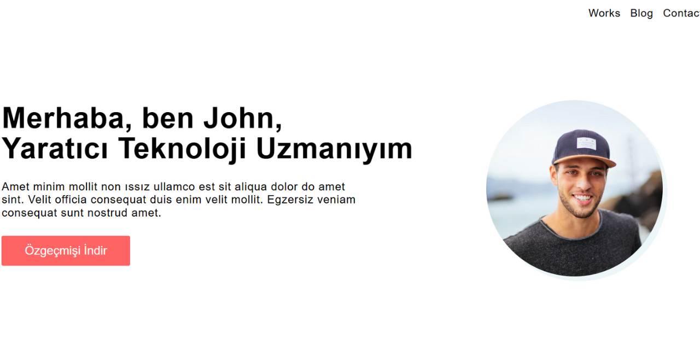

# 🌐 Proykt HTML & CSS

Basit ama şık bir çok sayfalı web şablonu. Portföy, blog veya tanıtım sitesi için ideal. HTML & CSS ile sıfırdan kodlandı.

## ✨ Sayfalar

- 🏠 `index.html` → Ana sayfa  
- 📝 `Blog.html` → Blog içerikleri  
- 💼 `work.html` → Çalışmalar  
- 🔍 `work-detal.html` → Detay sayfası

## 🎨 Özellikler

- Duyarlı (responsive) tasarım  
- Temiz ve anlaşılır kod yapısı  
- Kolayca özelleştirilebilir  
- Görsel odaklı düzen

## 🖼️ Önizleme




## 🚀 Kullanım

```bash
git clone https://github.com/Ruaaln/Proykt-html-css.git
cd Proykt-html-css
